# Aero Mouse Cursors with Drop Shadow

Twelve cursor themes are available:

<table>
	<thead>
		<tr>
			<th rowspan="2">Size</th>
			<th colspan="2">Right-handed</th>
			<th colspan="2">Left handed</th>
		</tr>
		<tr>
			<th>No shadow</th>
			<th>Shadow</th>
			<th>No shadow</th>
			<th>Shadow</th>
		</tr>
	</thead>
	<tbody>
		<tr>
			<td>Normal</td>
			<td>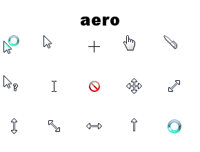</td>
			<td>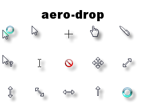</td>
			<td>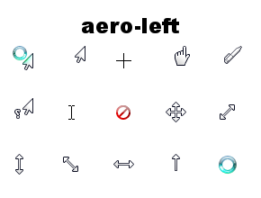</td>
			<td>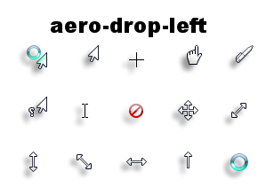</td>
		</tr>
		<tr>
			<td>Large</td>
			<td>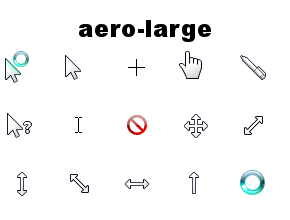</td>
			<td>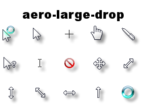</td>
			<td>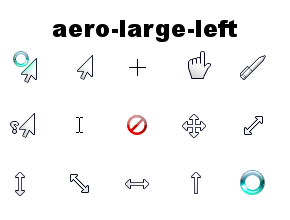</td>
			<td>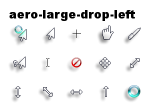</td>
		</tr>
		<tr>
			<td>Extra large</td>
			<td>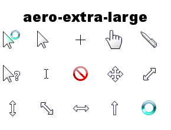</td>
			<td>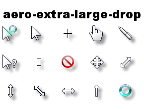</td>
			<td>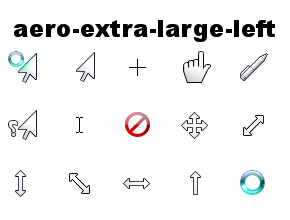</td>
			<td>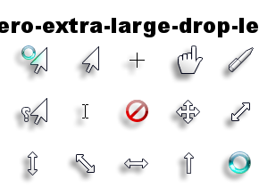</td>
		</tr>
	</tbody>
</table>
